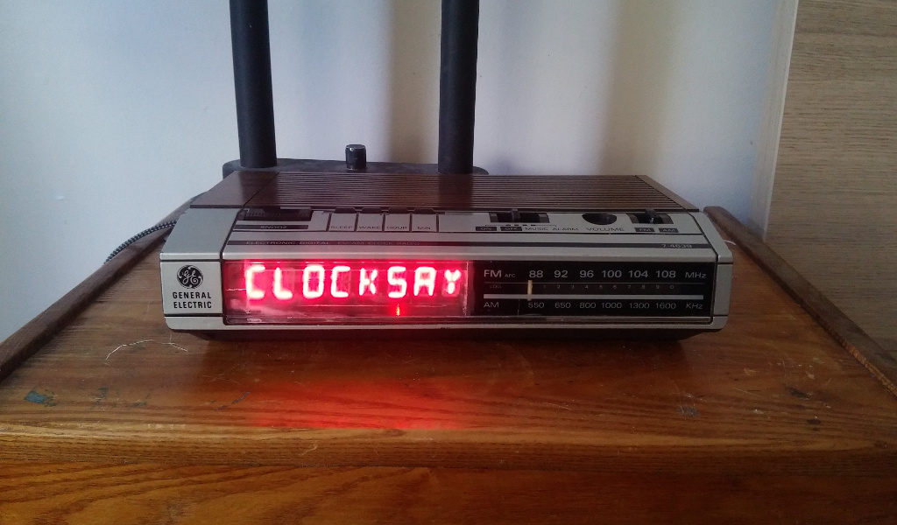

## What?

This is a go program for a weird clock. This runs on an orignal Raspberry Pi
Model B and communicates over i2c with a Holtek HT16K33 to display text on an
8x14 segment LED display.

I've jammed this junk inside of a "vintage" 1989 General Electric Model 7-4639A
clock radio.

## Why????

I DON'T KNOW!!!

